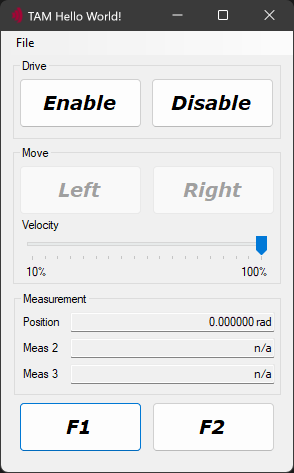
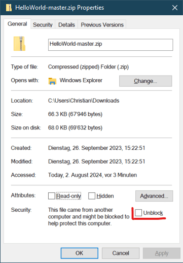

# TAM Hello World! - Training Branch

[](https://www.triamec.com/en/tam-api.html)

This application example helps you getting started to command a *Triamec* drive.

> [!NOTE]
> Modified version with a focus on hands-on experience.
>
> Exposes two additional measurements and two additional buttons with the code behind to be implemented by the students.

**Offline** (default): Run the application without a connected drive using a simulation.

**Connected**: Connect and move a real axis with a *Triamec* drive.



## Hardware Prerequisites

No hardware is needed when running the application as **Offline**.

To command a real axis, you need a *Triamec* drive with a motor and encoder connected and configured with a stable position controller. Connect the drive by *Tria-Link*, *USB* or *Ethernet*.

## Software Prerequisites

This project is made and built with [Microsoft Visual Studio](https://visualstudio.microsoft.com/en/).

In addition you need [TAM Software](https://www.triamec.com/en/tam-software-support.html) installation.

> [!WARNING]
> When downloading this code as ZIP, you possibly need to unblock the file prior unpacking.
> 
> <br/> Otherwise, Windows Defender might block the built application from running.

## Run the *Hello World!* Application

For the **Offline** mode, simply clone the repository, open the solution and hit run.

**Connected** mode:

1. Open the `Hello World!.sln`.
2. Open the `HelloWorldForm.cs` (view code)
3. Set the name of the axis for `AxisName`. Double check it in the register *Axes[].Information.AxisName* using the *TAM System Explorer*.
4. Adjust the `Distance` constant to an appropriate value in the unit of the axis, considering the axis range of motion. The unit can be found at *Axes[].Parameters.PositionController.PositionUnit*
5. Disable offline mode with `readonly bool _offline = false;`.
6. Now make sure the *TAM System Explorer* is not connected to the drive, or simply close it.
7. Start the application.

## Operate the *Hello World!* Application

Press **Enable** to activate the axis.

```csharp
void EnableDrive() {

    // Set the drive operational, i.e. switch the power section on.
    _axis.Drive.SwitchOn();

    // Reset any axis error and enable the axis controller.
    _axis.Control(AxisControlCommands.ResetErrorAndEnable);
}
```

Press **Left** and **Right**. The motor moves the `Distance` value in the corresponding direction. Both buttons trigger the same method. Change the speed with the slider.

```csharp
void MoveAxis(int sign) =>

    // Move a distance with dedicated velocity.
    // If the axis is just moving, it is reprogrammed with this command.
    // Please note that in offline mode, the velocity parameter is ignored.
    _axis.MoveRelative(Math.Sign(sign) * Distance, _velocityMaximum * _velocitySlider.Value * 0.01f);
```

Press **Disable** to switch off the axis.

```csharp
void DisableDrive() {

    // Disable the axis controller.
    _axis.Control(AxisControlCommands.Disable);

    // Switch the power section off.
    _axis.Drive.SwitchOff();
}
```
